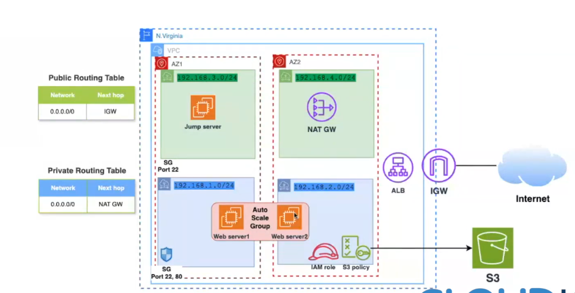

# 🌐 Secure terraform project

> A secure, scalable, and containerized web application deployed on **AWS** using **Terraform** and **Docker**, with infrastructure following cloud-native best practices: multi-tier architecture, IAM-based security, auto-scaling, and centralized logging.

[](https://www.terraform.io)
[](https://aws.amazon.com)
[](https://www.docker.com)
[](LICENSE)

[](project.png)  
*Architecture: VPC → Public Subnet (Jump Server + NAT GW) → Private Subnets (ASG Web Servers) → ALB + S3 (via IAM Role)*

---

## 🔍 Overview

This project automates the deployment of a production-grade web application on AWS using **Infrastructure-as-Code (Terraform)** and **containerization (Docker)**.

✅ **Key features**:
- 🔒 **Security-first design**: Jump server (bastion), private subnets, IAM roles (no hardcoded keys), and least-privilege security groups.
- 📈 **Auto-scaling & HA**: Web servers in an Auto Scaling Group behind an ALB, distributed across 2 Availability Zones.
- 🐳 **Dockerized app layer**: Easy updates, consistency, and portability.
- 📦 **S3 integration**: Web servers securely access static assets via IAM policies.
- 📊 **Monitoring-ready**: Logs and metrics can be shipped to CloudWatch (extendable with sidecar/log agents).

Ideal for DevOps portfolios, CV projects, or as a template for real-world web deployments.

---

## 🛠️ Tech Stack

| Layer          | Technology |
|----------------|------------|
| **IaC**        | Terraform (AWS Provider v6.23.0) |
| **Cloud**      | AWS (VPC, EC2, ALB, ASG, S3, NAT GW, IAM) |
| **Runtime**    | Docker + Linux (e.g., Amazon Linux 2) |
| **CI/CD**      | Jenkins (via pipeline — see `Jenkinsfile`) |
| **Lang**       | PHP (sample app), Bash, Terraform HCL |
| **Monitoring** | System logs (Python `psutil` scripts), CloudWatch (extendable) |

---

## 🚀 Quick Start

### Prerequisites
- AWS account + programmatic access (access key & secret)
- `terraform` (v1.7+), `aws-cli`, `docker` installed
- SSH key pair (e.g., `~/.ssh/id_rsa`)

### 1. Clone & Configure
```bash
git clone https://github.com/MohamedMahmoudDesouky/Docker-Webapp-Project.git
cd Docker-Webapp-Project

terraform init
terraform plan -out=tfplan
terraform apply tfplan

# 1. SSH into Jump Server
ssh -A -i ~/.ssh/your-key.pem ec2-user@$(terraform output -raw jump_server_public_ip)

# 2. From Jump Server, SSH into a web server (private IP)
ssh ec2-user@<WEB_SERVER_PRIVATE_IP>

Docker-Webapp-Project/
├── main.tf                 # Core infra: VPC, subnets, IGW, NAT, ALB, ASG
├── variables.tf            # Inputs (region, key name, instance type, etc.)
├── outputs.tf              # Exposed values (ALB DNS, IPs)
├── app/
│   ├── Dockerfile          # Builds web app image (PHP/Apache)
│   └── index.php           # Sample app (shows hostname/device ID for admin clarity)
├── scripts/
│   └── user_data.sh        # Bootstraps Docker + pulls/runs app on EC2
├── Jenkinsfile             # CI/CD pipeline (Git → Build → Deploy via Docker Compose)
└── project.png             # Architecture diagram

curl http://$(terraform output -raw alb_dns_name)
# Expected: HTML page with server hostname (e.g., "Web Server #1")

# Verify scaling: Trigger CPU stress → new instances launch automatically.
